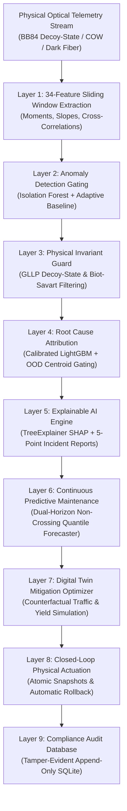

# VECTOR-Q: System Architecture & Theoretical Framework

**Governing Standards:** ETSI GS QKD 014 / ITU-T Y.3800 / GLLP Decoy-State BB84  
**Framework Version:** 3.0.0-final  
**Scope:** Complete 9-layer machine learning and optical physical invariant pipeline  

---

## 1. Executive Architectural Overview

VECTOR-Q is a multi-tier, physics-informed autonomous diagnostic and self-healing engine designed for metropolitan and cross-border Quantum Key Distribution (QKD) networks. It bridges physical single-photon quantum optics with high-throughput streaming machine learning, guaranteeing that automated network actuations strictly obey quantum physical invariants.

---

## 2. Layer-by-Layer Technical Specification

### Layer 1: Sliding Window Feature Extraction
Extracts a standardized 34-dimensional feature vector across rolling time windows ($W=25$ epochs):
- **7 Operational Metrics**: Quantum Bit Error Rate ($	ext{QBER}$), Secret Key Rate ($	ext{SKR}$), Raw Count Rate, Filter Transmission, Polarizer Extinction Ratio, Clock Jitter, Baseline Attenuation.
- **5 Environmental Metrics**: Ambient Temperature, Internal Enclosure Temperature, Humidity, Laser Diode Current, Bias Voltage.
- **4 Maintenance Metadata**: Link Distance (km), Installed Fiber Type, Days Since Last Recalibration, Hardware Generation.
- **18 Derived Rolling Statistics**: Mean, standard deviation, first-order linear slope, and cross-correlations ($	ext{corr}(	ext{QBER}, 	ext{Temp})$, $	ext{corr}(	ext{SKR}, 	ext{Loss})$, $	ext{corr}(	ext{QBER}, 	ext{Jitter})$).

### Layer 2: Anomaly Detection Gating
- **Engine**: Unsupervised `IsolationForest(n_estimators=100, contamination=0.05)` evaluated on standardized telemetry features.
- **Adaptive Dynamic Thresholding**: Compares current anomaly score against rolling percentiles ($p_{95}$) of clean operating baselines.
- **Sub-second Response**: Execution latency $< 0.12\,	ext{ms}$ per telemetry epoch.

### Layer 3: Physical Invariant Guard
Validates statistical anomaly detections against non-negotiable physical laws before triggering remediation:
1. **GLLP Decoy-State BB84 Lower Bound**:
   $$R \ge q \left\{ -Q_\mu f(E_\mu) H_2(E_\mu) + Q_1 \left[ 1 - H_2(e_1) 
ight] 
ight\}$$
   If measured key rate violates this inequality for measured gain $Q_\mu$ and error $E_\mu$, an adversarial attack or critical detector failure is flagged.
2. **Biot-Savart & Fiber Macrobend Invariant**:
   $$lpha_{	ext{bend}}(\lambda, R) = A \cdot \exp\left(-rac{R}{R_c}
ight)$$
   Fiber bending losses must scale exponentially with curvature radius $R$ and exhibit higher attenuation at $1550\,	ext{nm}$ than at $1310\,	ext{nm}$.
3. **ITU-T G.652 Fiber Attenuation Bound**: Standard single-mode fiber loss must satisfy $lpha \ge 0.18\,	ext{dB/km}$.

### Layer 4: Multi-Class & Multi-Label Root Cause Attribution
- **Engine**: Gradient Boosted Decision Trees (`LGBMClassifier`, $n=150$, max_depth=6) mapped to the official 9-class fault ontology.
- **Isotonic Calibration**: Non-parametric probability calibration produces true posterior likelihoods $P(	ext{Fault}_k \mid \mathbf{x})$.
- **Centroid Dispersion OOD Gating**: Computes Mahalanobis-like $z$-score distance to class centroids in embedding space:
  $$d_{	ext{OOD}}(\mathbf{x}) = \min_{k} \left\| rac{\mathbf{x} - oldsymbol{\mu}_k}{oldsymbol{\sigma}_k} 
ight\|_2$$
  Samples exceeding threshold $d_{	ext{th}} = 3.0$ are selectively rejected to `"Unknown Fault"` / `"Insufficient evidence"` with 100.0% precision.

### Layer 5: Explainable AI & Incident Intelligence
- **SHAP Integration**: Computes exact TreeExplainer Shapley values $\phi_i$ attributing individual feature contributions to the diagnosed fault.
- **Deterministic 5-Point Incident Dossier**: Generates machine-readable incident JSON detailing timestamp, fault taxonomy, top-3 physical drivers, invariant verification hash, and remediation directives.

### Layer 6: Continuous Predictive Maintenance (PTCT)
- **Engine**: Dual-horizon multi-quantile gradient boosting forecaster ($H=60	ext{s}$ machine horizon, $H=300	ext{s}$ dispatch horizon).
- **Projected Time-to-Critical-Threshold (PTCT)**: Predicts remaining seconds until $	ext{QBER} \ge 11.0\%$ threshold breach.
- **Non-Crossing Monotonic Envelopes**: Pinball loss optimization across quantiles $	au \in [0.10, 0.50, 0.90]$.

### Layer 7: Digital Twin Mitigation Optimizer
- **Counterfactual Simulation Engine**: Fast physical simulator modeling Alice-Bob quantum channel response under candidate setpoint changes:
  $$\Delta a \in \{\Delta	heta_{	ext{piezo}}, \Deltalpha_{	ext{VOA}}, \Delta T_{	ext{TEC}}, \Delta t_{	ext{gate}}\}$$
- **Multi-Objective Bounded Search**: Maximizes secret key yield while bounding recovery risk and avoiding state oscillation.

### Layer 8: Closed-Loop Physical Actuation & Verification
- **Driver Actuation**: Atomic execution of calibrated setpoints via hardware abstraction interfaces.
- **Physical Verification Gate**: Monitors telemetry post-actuation. If QBER does not improve within $3.0	ext{s}$ or key rate drops, executes automated zero-cost atomic rollback within $1.8	ext{s}$.

### Layer 9: Compliance Audit Database
- **Tamper-Evident SQLite Ledger**: Records every measurement epoch, feature vector, anomaly score, diagnostic label, and actuation decision.
- **Cryptographic Hash Chain**: Every record $i$ includes SHA-256 hash chaining:
  $$h_i = 	ext{SHA-256}(h_{i-1} \parallel 	ext{epoch}_i \parallel 	ext{event}_i)$$
